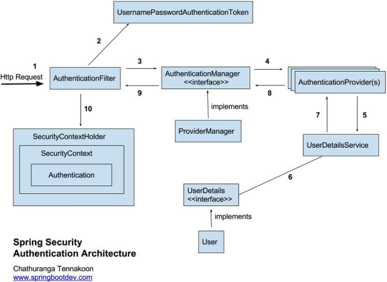

# Spring boot, security JWT example

## References
- [SilverNine - spring-boot-jwt-tutorial](https://github.com/SilverNine/spring-boot-jwt-tutorial)

## Spring security architecture


## JWT
- [RFC 7519](https://datatracker.ietf.org/doc/html/rfc7519)
- JSON Web Token (Header(algorithm), Payload, Signature)

## Create docker test mariadb
### Official image
- https://hub.docker.com/_/mariadb

### Script
```shell
docker run -p 127.0.0.1:3306:3306 --name test-mariadb -e MARIADB_ROOT_PASSWORD=1234 -d mariadb
docker start test-mariadb
docker exec -it some-mariadb bash
docker logs some-mariadb
```

### Config
- Driver: org.mariadb.jdbc.Driver
- Username: root
- Password: 1234
- URL: jdbc:mariadb://localhost:3306/jwt